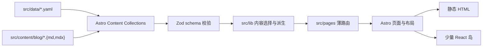

# 项目架构

本项目是静态优先的双语个人主页。Astro 负责路由、数据加载、Markdown/MDX 和页面组合；React 只承载需要浏览器状态的交互；Tailwind CSS 与 shadcn/ui 提供样式和基础组件。

## 数据流

配置和内容只通过 Content Collections 进入页面。schema 负责字段形状和基础约束，内容模块负责译文分组、草稿过滤、排序、分页、标签与语言回退，页面组件接收已经确定的数据并渲染。

## 目录职责

| 目录 | 职责 |
| --- | --- |
| `src/data/` | 站点、About 和项目 YAML 配置 |
| `src/content/blog/` | 博客 Markdown 与 MDX，`src/content/` 下唯一的正文集合 |
| `src/lib/config/` | Content Collections 使用的 Zod schema |
| `src/lib/content/` | 博客、项目、封面、分页、搜索和阅读时间逻辑 |
| `src/pages/` | 中文与英文的薄路由入口和静态路径生成 |
| `src/layouts/` | HTML 文档、侧栏壳和文章壳 |
| `src/components/astro/` | 页面级组合与静态内容组件 |
| `src/components/react/` | shadcn 展示组件和浏览器交互 |
| `src/i18n/` | 语言类型、文案、路径与语言切换 |
| `src/lib/comments/` | 评论配置分发、懒加载、重试和清理 |
| `src/styles/` | 全局、布局、列表、文章和评论样式 |

## 页面与组件边界

路由文件只负责声明语言、调用 `getStaticPaths()` 或传入页面 props。页面内容在 `src/components/astro/pages/` 组合，公共页面框架由 `SidebarLayout.astro` 和 `BaseLayout.astro` 提供。

Astro 文件中没有 `client:*` 的 React 组件只生成静态 HTML。当前客户端边界是：

- `AppShell client:load`：管理侧栏、移动菜单、主题和语言菜单。
- 博客搜索岛：只在搜索页加载，接收构建期生成的最小文章元数据。
- 评论：不建立常驻 React 岛；评论区接近视口时动态导入 Waline 或 Twikoo 客户端。

列表、卡片、标签、分页、个人资料和 About 正文不应新增独立水合根。

## 内容与双语路由

Astro i18n 的默认语言是中文：中文页面不带前缀，英文页面使用 `/en`。公开路径统一通过 `src/i18n/routes.ts` 生成，避免页面自行编码语言和标签规则。

博客按 `translationKey` 分组，项目通过 `translations` 保存双语字段。内容模块在构建期选择当前语言版本；缺译时回退到原文。文章详情只为实际发布的语言输出内容，缺译路由重定向至已发布原文。

`site.yaml` 中的 `navigation` 只决定侧栏入口和顺序。新增公开页面仍通过 Astro 文件路由实现；如果需要加入主导航，再同步扩展路由配置、语言文案和导航 schema。

## 性能约定

- 默认生成静态页面，不引入 SSR 或运行时内容查询。
- 构建期可确定的状态留在 Astro，不为静态卡片和列表增加 `client:*`。
- 搜索元数据不包含正文或封面，也不进入其他页面。
- 评论客户端在接近评论区时加载，并保留失败重试与卸载清理。
- 图片封面交给 Astro 内容图片能力处理；生成式等高线在构建期输出。

## 修改入口

- 个人资料、导航、评论和封面：参见[配置说明](configuration.md)。
- Markdown/MDX、译文、标签和草稿：参见[博客写作](blogging.md)。
- 新增页面或调整组件边界：先遵循本页的数据流和客户端边界，再同步中英文路由与测试。
